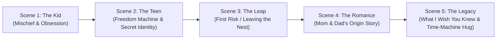
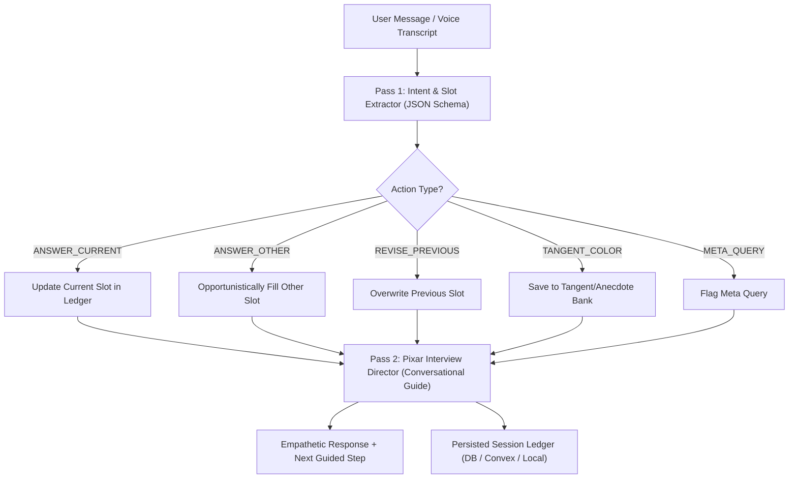

# My Pixar Story — Format Specification & Decision Record

**Working Title:** My Pixar Story  
**Target Audience:** Parents & Grandparents creating personal animated memoirs for their children, spouses, or family archives.  
**Core Premise:** "How cool would it have been to see our parents grow up?" An emotional, cinematic 3D animated short film in the warm, whimsical aesthetic of a classic Pixar prologue (e.g., *Up*, *Coco*), chronicling a parent's journey from childhood through adolescence, romance, challenges, and into family life.

---

## 1. Core Architecture Decisions

### 1.1 Video Generation & Cost Tiering
Video generation is the primary cost driver. We establish a flexible building-to-final pipeline:

| Stage | Model Options | Resolution | Purpose | Cost Profile |
| :--- | :--- | :--- | :--- | :--- |
| **Draft & Building (Default)** | **SeaDance 2.0 Mini**<br>or **SeaDance 2.5** | **480p** | Generation, previewing, rerolls, beat pacing, and narrative alignment. 2.0 Mini is fastest/cheapest; 2.5 @ 480p offers high-fidelity previewing during creation. | Ultra low-cost, fast iteration. |
| **Final Render (Paid/Opt-in)** | **SeaDance 2.5** | **Full Res (1080p+)** | Final archival export primarily for upscaling, maximum fidelity, and cinematic lighting once the user approves the cut. | High fidelity, paid final export tier. |

* **Rule:** Building and draft iterations use SeaDance 2.0 Mini or SeaDance 2.5 at 480p. SeaDance 2.5 in Full Resolution is reserved exclusively for the final export pass.

---

## 2. Narrative Arc & Questionnaire Framework

> **The Golden Rule:** In Pixar shorts and generative video production:  
> **1 Question = 1 Story Beat = 1 Rendered Scene.**  
> 
> *The full bank of 21 ranked questions is permanently preserved in the [Master Question Vault](my-pixar-story-master-questions.md).*

The canonical v1 intake questionnaire is trimmed to **The Golden 5** — five high-voltage questions mapping directly to the 5 visual scenes:



### 2.1 The Golden 5 Questions

#### Scene 1: The Mischief & The Obsession (Ages 7–10)
* **Prompt:** *"Take us back to you at 8 years old: who was your partner-in-crime, what silly trouble did you get into, and what was your weird obsession that you thought was the coolest thing on earth?"*
* **Buckets:** The Outdoor Explorer • The Lego/Fort Builder • The Comic/Dinosaur Fanatic • The Biker/Skater • The Neighborhood Prankster
* **Pixar Scene:** Golden-hour afternoon, wide-eyed 3D kid running with their best friend, bedroom overflowing with their signature obsession.

#### Scene 2: The Freedom Machine & Secret Identity (Ages 15–18)
* **Prompt:** *"What was your first real taste of freedom—what were you driving or riding, and what is one thing about teenage you that would completely shock your kids if they saw you back then?"*
* **Buckets:** First beat-up car • BMX bike / Skateboard • Cruising main street • Garage band rocker • Secret athlete / artist
* **Pixar Scene:** Cinematic night drive with the car windows down, neon reflections on the dashboard, rocking their real retro hairstyle.

#### Scene 3: The Leap of Faith (Ages 19–25)
* **Prompt:** *"What was the craziest risk or adventure you took when you first stepped out into the world on your own, and the moment you realized 'I actually did it'?"*
* **Buckets:** Moving away with two bags • Scrappy first job grind • Starting a business on ramen • Backpacking / solo trip
* **Pixar Scene:** Solitary figure standing in a bustling train station or looking out an apartment window, determined, hopeful, leaving the nest.

#### Scene 4: Mom & Dad’s Origin Story (Romance)
* **Prompt:** *"How did you meet Mom/Dad, what was the most awkward or hilarious thing that happened when you were trying to impress them, and when did you know they were 'the one'?"*
* **Buckets:** High school/college sweethearts • Workplace encounter • Clumsy first date • Blind date / setup • Unlikely friends first
* **Pixar Scene:** Two characters sharing coffee or caught under an umbrella in the rain, blushing, clumsy charm, warm string-light bokeh.

#### Scene 5: What I Wish You Knew & The Time-Machine Hug (Finale)
* **Prompt:** *"What is one thing you wish your kids truly understood about who you are inside—and if you could walk up to that 8-year-old kid on the bicycle and give them a hug today, what would you tell them?"*
* **Emotional Payload:** "I was once scared and young too" + The core family truth.
* **Pixar Scene (The Tearjerker):** Modern 3D adult character kneeling down in front of their 8-year-old self with a warm, proud smile, transitioning into the family portrait.

---

## 3. Technical Component Breakdown

### 3.1 Input Contract (`inputs.json`)
```typescript
export interface MyPixarStoryInputs {
  subject: {
    fullName: string;
    preferredName: string;
    referencePhotoUrls: string[]; // 1–3 modern photos of parent + optional spouse photo
    gender: 'male' | 'female' | 'non-binary';
    keyPhysicalTraits: {
      hairColor: string;
      hairStyle: string;
      eyeColor: string;
      glasses: boolean;
      distinctiveFeatures?: string[];
    };
  };
  // The Golden 5 Canonical Answers (1 Question = 1 Story Beat = 1 Rendered Scene)
  answers: {
    scene1Childhood: {
      partnerInCrime: string;
      sillyTrouble: string;
      weirdObsession: string;
    };
    scene2TeenFreedom: {
      freedomMachine: string; // e.g. "1992 Honda Civic" or "BMX bike"
      secretTeenIdentity: string; // e.g. "I was in a grunge rock band"
    };
    scene3LeapOfFaith: {
      riskOrAdventure: string;
      triumphMoment: string;
    };
    scene4Romance: {
      howWeMet: string;
      awkwardDateMoment: string;
      theMomentIKnew: string;
    };
    scene5LegacyFinale: {
      whatIWishKidsUnderstood: string;
      timeMachineMessageToChildSelf: string;
    };
  };
  audio: {
    narrationMode: 'parent_clone' | 'storybook_narrator';
    voiceCapture?: {
      source: 'upload' | 'browser_record';
      audioUrl: string;
      durationSeconds: number; // minimum 10 seconds required
    };
    preferredStorybookVoice?: 'warm_morgan_freeman' | 'warm_pixar_maternal' | 'warm_pixar_paternal';
  };
  tone: 'heartwarming_tearjerker' | 'playful_adventure' | 'triumphant_inspirational';
}
```

### 3.2 Visual & Video Generation Pipeline
1. **Character DNA Seed:**  
   Derive a fixed character appearance descriptor from reference photos and questionnaire metadata (e.g. *"round wireframe glasses, tousled brown wavy hair, warm hazel eyes, dimpled smile"*). This descriptor is pinned across all prompt generations.
2. **Life-Stage Prompt Injection:**
   * *Scene 1 (Age 7):* *"Young 7-year-old boy/girl [Character DNA], small stature, oversized sweater..."*
   * *Scene 2 (Age 16):* *"Teenager aged 16 [Character DNA], high school jersey/letterman or backpack..."*
   * *Scene 3 (Age 23):* *"Young adult aged 23 [Character DNA], tired eyes, determined expression, cozy apartment..."*
   * *Scene 4 (Age 28):* *"Young adult aged 28 [Character DNA] meeting future spouse under warm cafe string lights..."*
   * *Scene 5 (Present):* *"Adult in their 40s/50s [Character DNA] smiling warmly at the camera with spouse/family..."*
3. **Pixar Style Enforcement:**  
   Universal style modifier:
   > `"Pixar 3D animated film render, Disney/Pixar character aesthetics, soft sub-surface scattering skin, expressive large emotional eyes, cinematic 3D lighting, warm color palette, Unreal Engine 5 / Octane 3D look, masterpiece."`
4. **Video Models:**
   * **SeaDance 2.0 Mini @ 480p** for generating candidate scene videos and instant timeline assembly.
   * **SeaDance 2.5 @ 1080p** for final re-render upon client checkout/export.

### 3.3 Audio Pipeline & Voice Cloning
1. **Audio Capture Engine:**
   * Two input mechanisms: **File Upload** (.mp3, .wav, .m4a) OR **Live Browser Microphone Recording** right in the intake modal.
   * **Minimum Gate:** User must provide at least **10 seconds** of clean speaking audio. The UI provides a real-time progress meter and a sample prompt to read aloud (e.g., *"When I was little, I thought the world was huge..."*).
2. **Narration Modes:**
   * **Option A (Primary / Personal Default):** The parent's own voice cloned via **Cartesia Sonic** narrating their own memoir in the first person (*"When I was seven, I wanted to build spaceships..."*).
   * **Option B (Cinematic Storybook):** A warm, Morgan Freeman / Pixar-narrator voice telling the story in third person directly to the kids (*"Long before he was Dad, he was just a kid in a dusty backyard with big dreams..."*).
3. **Voice Synthesis Model:**
   * **Cartesia Sonic** is the primary default model for zero-shot instant voice cloning from the 10-second reference clip (with fallback option to ElevenLabs).
4. **Musical Score:** Emotional orchestral score (nostalgic piano opening $\rightarrow$ melancholic strings $\rightarrow$ grand crescendo resolution).

### 3.4 Composition & Rendering
* Integrated with Wiggly's standard `AdRenderSurface` / Remotion runtime.
* Features synced animated karaoke-style or subtitle captions.
* Color grading overlay: warm vintage nostalgia tone for childhood scenes, graduating to clean, vibrant contemporary grading.

---

## 4. Orchestrator State Machine & Session Tracking Architecture

### 4.1 The Core Problem
Conducting a personal memoir interview with an LLM in a raw, unconstrained chat context invariably fails for five reasons:
1. **Nostalgia Tangents:** Parents wander off into charming anecdotes that don't answer the active question.
2. **Multi-Slot Utterances:** A user answering about college might casually mention how they met their spouse, prematurely addressing future beats.
3. **Revisions & Second Thoughts:** *"Actually, wait, don't say I wanted to be an astronaut, I was actually obsessed with trains."*
4. **Meta Questions:** *"Wait, who gets to see this video?", "How much does the 1080p version cost?"*
5. **Session Drop-off:** Closing the browser mid-interview and losing progress.

### 4.2 The Solution: The "Interview Ledger" + Two-Pass Turn Engine

We decouple the **conversational empathy (LLM)** from the **state tracking (Deterministic Ledger)**.



### 4.3 Structured Session Schema (`InterviewSessionState`)

The state is stored in a canonical, persisted JSON record:

```typescript
export type SlotStatus = 'unseen' | 'in_progress' | 'filled' | 'confirmed';

export interface NarrativeSlot {
  id: string; // e.g., 'roots_environment', 'childhood_dream', 'the_crucible', 'meeting_spouse'
  beat: 1 | 2 | 3 | 4 | 5;
  title: string;
  questionPrompt: string;
  status: SlotStatus;
  userRawTranscript?: string;
  distilledAnswer?: string;
  selectedBucket?: string;
  emotionalKeywords?: string[];
}

export interface TangentMemory {
  id: string;
  timestamp: string;
  content: string;
  possibleBeatRelevance: number; // Beat 1–5 or general flavor
}

export interface CharacterVisualProfile {
  status: 'pending_upload' | 'detected' | 'confirmed';
  sourcePhotoUrls: string[];
  confirmedTraits: {
    gender: 'male' | 'female' | 'non-binary';
    ageBracket: '30s' | '40s' | '50s' | '60s' | '70s+';
    hairColor: 'dark_brown' | 'black' | 'blonde' | 'red' | 'grey' | 'white' | 'bald';
    hairStyle: 'short' | 'wavy' | 'curly' | 'long' | 'buzz';
    eyeColor: 'brown' | 'blue' | 'green' | 'hazel';
    glasses: 'none' | 'wireframe' | 'bold_dark';
    facialHair?: 'none' | 'stubble' | 'short_beard' | 'full_beard' | 'mustache';
    skinTone?: string;
    signatureTraits?: string[]; // e.g. "freckles", "dimples"
  };
  // The pinned character prompt compiled from confirmed traits and photo analysis
  compiledCharacterDnaPrompt: string;
}

export interface InterviewSessionState {
  sessionId: string;
  userId: string;
  subjectName: string;
  recipientName: string; // e.g., "Lisa", "Hailie"
  createdAt: string;
  updatedAt: string;
  
  // Orchestrator Pipeline Stepper
  pipelineStage: 
    | 'visual_profile_onboarding' // Step 1: Upload photo -> Vision AI detects -> User 4-tap confirm
    | 'audio_capture'             // Step 2: 10s voice recording or upload -> verified
    | 'golden_5_interview'        // Step 3: Scene 1 to 5 narrative interview
    | 'script_review'             // Step 4: Review compiled 5-scene Pixar script
    | 'draft_preview_rendering'   // Step 5: SeaDance 2.0 Mini / 2.5 480p preview
    | 'draft_preview_ready'       // Step 6: Watch draft cut, approve or reroll scenes
    | 'final_export_rendering'    // Step 7: SeaDance 2.5 Full Res export
    | 'completed';
    
  // 1. Visual Character State (NEVER relies on celebrity knowledge)
  visualProfile: CharacterVisualProfile;

  // 2. Audio State (Cartesia Sonic Voice Clone)
  audioCapture: {
    status: 'pending' | 'recorded' | 'uploaded' | 'verified';
    durationSeconds: number;
    audioFileUrl?: string;
    narrationMode: 'parent_clone' | 'storybook_narrator';
  };

  // 3. Narrative State Machine
  currentActiveSlotId: 'scene1Childhood' | 'scene2TeenFreedom' | 'scene3LeapOfFaith' | 'scene4Romance' | 'scene5LegacyFinale';
  slots: Record<string, NarrativeSlot>;
  
  // 4. Tangent / Color Bank (preserves off-topic stories for scene dressing)
  anecdoteBank: TangentMemory[];
}
```

### 4.4 Two-Pass Turn Loop & Conversational Policies

1. **Pass 1: Extractor Turn (JSON Schema Output)**
   The user's message is sent to an extraction prompt with the current `InterviewSessionState`. The output classifies:
   * `action`: `'answer_current'` | `'answer_other'` | `'revise'` | `'tangent'` | `'meta_question'`
   * `extractedSlotId`: the target slot ID
   * `distilledContent`: 1–2 sentence essence of their story
   * `selectedBucket`: best matching bucket (if applicable)
   * `confidence`: `0.0` to `1.0` (high > 0.85 = auto-fill; medium 0.5–0.85 = tentative soft-confirm; low = tangent)
   * `tangentSnippet`: any extraneous anecdote to preserve for future scene coloring
   
2. **Pass 2: Director Turn (Empathetic Guide Prompt)**
   The Director receives the updated `InterviewSessionState` and follows the **Bridge & Pivot** interview policy:
   * **If a slot was filled (High Confidence):** Enthusiastically validate their memory with Pixar-director warmth (e.g. *"I love that your dad built that treehouse with you..."*), then transition naturally to the next unfilled slot.
   * **If medium confidence:** Use a gentle confirmation: *"It sounds like you spent most of your time in the art studio rather than with the sports crowd—does that feel right, or was there another side to you?"*
   * **If a tangent occurred (The Bridge & Pivot):**
     1. *Validate/Savor:* Appreciate the memory (*"Haha, that 1984 road trip in the station wagon sounds unforgettable!"*).
     2. *Bridge:* Create an organic connection (*"...and that kind of chaos definitely prepares you for life."*).
     3. *Pivot:* Re-anchor back to the active slot (*"Did that adventurous streak show up in who you hung out with in high school, or were you more focused on sports or arts?"*).
   * **If a meta question was asked:** Answer the question directly and concisely (*"Only your family gets to see this private link unless you choose to download or share it."*), then seamlessly re-anchor: *"Where we left off: how did you two first cross paths?"*

### 4.5 Checkpointing & "Time Travel" (Session Rollbacks)
* Every conversational turn saves an immutable state checkpoint (`checkpoints: SessionCheckpoint[]`).
* If a parent says, *"Actually, wait, can we change what I said about college? I don't want to talk about that job,"* the orchestrator triggers a state rollback to that beat's starting checkpoint. Prior and future unrelated slots remain safely intact.

### 4.6 Visual Progress Stepper (UI Grounding)
In the UI, the chat/interview interface is accompanied by a **persistent progress rail**:
* Displays 5 milestone beats with checkmarks:
  * `[✓ Roots & Dreams] → [✓ High School] → [● The Struggle (Current)] → [○ Love Story] → [○ Legacy] → [○ Voice]`.
* If a parent gets distracted, the visual stepper immediately reminds them where they are in the story.
* Parents can click any prior completed step to view or edit their answer without restarting.

---

## 5. Version 2 Roadmap: Scrapbook Memorabilia & Background Realism

*(Marked for v2 implementation once core format pipeline is validated)*

* **Scrapbook & Family Memorabilia Uploads:** Allow parents to upload scans of old childhood scrapbook photos, ticket stubs, family heirlooms, or trophies.
* **Childhood Home & Neighborhood Anchoring:** Optional input of childhood home address or photo.
* **Pixar Easter Egg Generation:** Use uploaded memorabilia to populate authentic Pixar-style background details (e.g., a 3D animated version of the family's real station wagon in the driveway, actual childhood artwork pinned to the refrigerator, or a camera pan across a shelf featuring their real childhood items rendered in 3D).

---

## 6. Official Implementation Milestones & Status Ledger

This ledger is the living record of progress for the **My Pixar Story** format. Every phase requires automated verification before progressing to the next.

| Milestone | Title | Status | Core Deliverables | Verified Test / Artifacts |
| :--- | :--- | :---: | :--- | :--- |
| **M1** | **State Machine & Interview Orchestrator** | **DONE** | • `stateMachine.ts` (Two-Pass turn loop, Bridge & Pivot)<br>• `types.ts` (Contracts, Session state, Slots)<br>• `prompt.ts` (Character DNA, SeaDance 3D prompts)<br>• `screenplay.ts` (Golden 5 -> timed narration)<br>• `validate.ts` (Pre-flight input/storyboard checks) | • `tests/stateMachine.test.ts` (PASSING, 11/11 turns)<br>• `tests/smoke.test.ts` (PASSING offline)<br>• Proofs: `steve-jobs-to-lisa.json`, `marshall-mathers-to-hailie.json` |
| **M2** | **Remotion Visual Renderer Component** | **DONE** | • `render.tsx` (5-scene timeline player)<br>• 2.5D Ken Burns animated camera transitions<br>• Video playback with procedural 3D preview fallback<br>• Atmospheric color grading per beat (Pixar lighting)<br>• Word-synchronized animated subtitle overlays<br>• Recipient dedication header ("For Lisa") | • `tests/render.test.tsx` (PASSING, 5/5 scene timeline tests)<br>• Clean TypeScript check (0 errors) |
| **M3** | **Format Registry & Scene Contract Parity** | **IN PROGRESS (NEXT)** | • `registry.ts` integration (discoverable format in v3)<br>• `createMyPixarStoryScene.ts` (Canonical `AdScene` payload)<br>• Non-negotiable parity across Preview, Download, and Share | • `v3/tests/format-registry.test.ts` update<br>• `v3/tests/render-parity.test.tsx` integration |
| **M4** | **Provider Runners (Audio & Video)** | **PENDING** | • `providers/audio.ts` (Cartesia Sonic zero-shot voice cloning)<br>• `providers/video.ts` (SeaDance 2.0 Mini / 2.5 480p draft + 2.5 Full Res export)<br>• Rule 12 zero-silent-fallback error boundary | • Isolated mock provider tests<br>• Free smoke test with dry-run provider mode |
| **M5** | **Media Quality Inspection & Receipts** | **PENDING** | • `inspect.ts` (Automated quality gate)<br>• 5-frame contact sheet generation<br>• Audio continuity / dead-air detector<br>• `receipt.json` provenance generator | • Contact sheet visual artifact<br>• Passing continuity checks |
| **M6** | **Front-End Intake UI & Progress Stepper** | **PENDING** | • 5-milestone persistent progress rail<br>• 10-second in-browser mic recorder & file uploader<br>• "The Pixar Mirror" 4-tap character confirmation card<br>• Conversational chat shell wired to `stateMachine.ts` | • Playwright browser smoke test on `/create` |
| **M7** | **Packaged Format Kit & Blind-Agent Proof** | **PENDING** | • Package format kit in `v3/public/format-repositories/my-pixar-story-v1/`<br>• Run Blind-Agent proof (clean agent executes full command loop)<br>• Publish rich repo showcase on `/format-lab/my-pixar-story` | • Blind-agent test report<br>• Downloadable format kit artifact |
| **M8** | **v2: Scrapbook Memorabilia & Easter Eggs** | **FUTURE (v2)** | • Family scrapbook & childhood memorabilia photo upload<br>• Childhood home / neighborhood address anchoring<br>• 3D animated background Easter egg injection | • High-fidelity personalized render samples |
